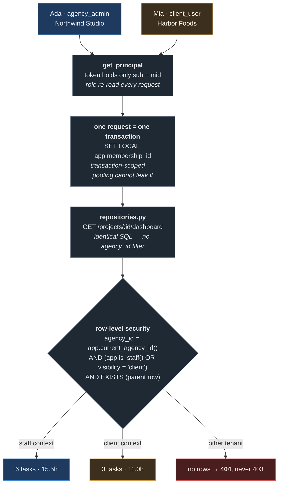
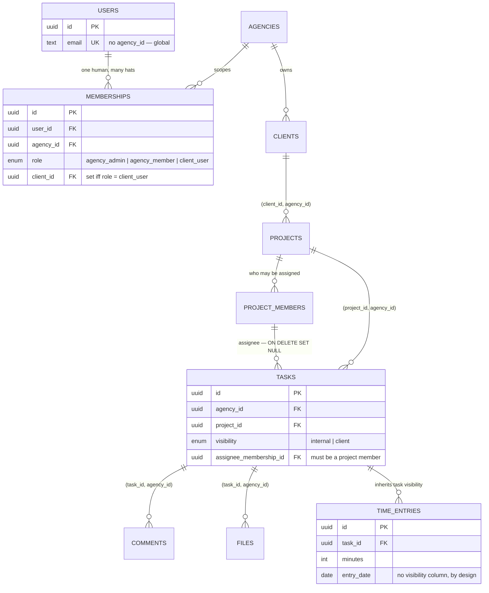

# DESIGN

## The shape of a request

Identity is resolved in the application; **what you may see is decided in the
database**. The same SQL serves everyone — only the context differs.



The application connects as `agencydesk_app` — owns nothing, no DDL,
`NOBYPASSRLS`. It cannot turn any of this off, so the boxes above are not a
convention the next endpoint might forget.

## How the schema enforces tenant isolation

Two mechanisms, both in the database.

**Composite foreign keys.** Every tenant-owned table carries `agency_id`, and every
child references its parent by the *pair* — `projects(client_id, agency_id) →
clients(id, agency_id)`, on down to comments, files and time entries, each parent
carrying `UNIQUE (id, agency_id)`. A row cannot be stitched to another tenant's
row even by a deliberate insert with a stolen id: the pair does not exist, so the
insert fails.

**Row-level security.** The app connects as `agencydesk_app` — owns nothing, no
DDL, `NOBYPASSRLS`; migrations run as a separate owner. Each request is one
transaction issuing `SET LOCAL app.membership_id = …`, which policies resolve to
an agency, role and client. Being transaction-scoped, a pooled connection cannot
carry one caller's identity into the next request, and an unauthenticated request
evaluates every policy against a NULL agency and sees nothing. Deny-by-default is
the resting state, not a rule someone remembered to write.

No `SELECT` in `repositories.py` filters on `agency_id`. A query that is wrong
there returns too little, never too much.

Cross-tenant reads return **404, never 403** — a 403 confirms an id is real and
turns the endpoint into an enumeration oracle.

Every arrow below is a *pair*, `(id, agency_id)`. Note where `agency_id` is
absent: `users` is global, which is what lets one person work at two agencies.



## How a client is blocked from internal content

`tasks`, `comments` and `files` carry a `visibility` enum; client policies add
`AND visibility = 'client'`. The load-bearing part is that child tables scope
themselves as `EXISTS (SELECT 1 FROM <parent> …)`, and that subquery runs under
the parent's policy — so **visibility composes**. Hide a task and its comments,
files and hours vanish from every query that could reach them: lists, search,
filters, aggregates, dashboard. `time_entries` has no flag at all; it inherits
the task's, which is why a client's hour total excludes internal work without a
line of code saying so.

So the awkward cases fall out rather than needing to be remembered: search is
three plain `SELECT`s over protected tables; the dashboard runs identical SQL for
everyone (agency 6 tasks / 15.5h, Harbor Foods 3 / 11.0h), so totals can never
disagree with the board beside them; an internal comment stays hidden on a task
the client can still read; and clients cannot create or move tasks, because
`app.is_staff()` is false and no write passes `WITH CHECK`.

## How one person spans two agencies

`users` is global and carries **no `agency_id`** — one row per human. Everything
tenant-scoped hangs off `memberships (user_id, agency_id, role, client_id)`,
unique on `(user_id, agency_id)`. `mia@harborfoods.test` is one account with two:
`client_user` at Northwind Studio, `agency_admin` at Bluepeak Digital.

Login is therefore two steps — `/auth/login` answers *who are you*,
`/auth/select-agency` answers *act as whom* and returns a session pinned to one
membership. A single-step login would have to invent an answer for Mia, and
eventually invent the wrong one. The token carries only `sub` and `mid`; role and
agency are re-read per request, so revoking someone takes effect on their next
call. Switching mints a new token rather than mutating the old, so a session is
bound to one tenant for its whole life.

## The edge case I am most pleased with

**Removing a team member mid-task**: their work is unassigned — not deleted, not
reassigned. Deleting destroys a trail the agency may need to bill from;
reassigning makes somebody accountable for work they have never seen.

What I like is where it lives. Not in the handler — in the key:

```sql
CONSTRAINT tasks_assignee_is_project_member
    FOREIGN KEY (project_id, assignee_membership_id)
    REFERENCES project_members (project_id, membership_id)
    ON DELETE SET NULL (assignee_membership_id)
```

PostgreSQL 15+ lets `SET NULL` name specific columns, so `project_id` (NOT NULL)
survives while the assignee clears, in the same statement as the removal. Read
forwards, it says an assignee must be a member of the project; read backwards,
that removal unassigns. No code path can produce a task pointing at a non-member.
`test_removal_is_enforced_by_the_database_not_the_handler` proves it by deleting
the membership row in raw SQL, bypassing the API entirely — the assignment still
clears.

## Notes and trade-offs

- `TASK_COLUMNS` uses correlated subqueries deliberately. Benchmarked
  (`scripts/bench_queries.py`): a grouped-join rewrite is 4.6x faster on a
  2,000-task board and **99x slower** on a small one, because it aggregates
  everything visible before joining. Agency boards are small.
- Policy helpers are `STABLE`, so the planner evaluates them once per query
  rather than once per row.
- Files sit on a local volume with random keys; production wants object storage
  and signed URLs — the authorisation path would not change. PBKDF2 so a clone
  runs with no native build; Argon2 in production.
- **Timeline / Gantt** (discussion only): dependencies as an adjacency table with
  a cycle-preventing trigger, critical path computed server-side in a recursive
  CTE, so the client never receives edges it cannot see.
